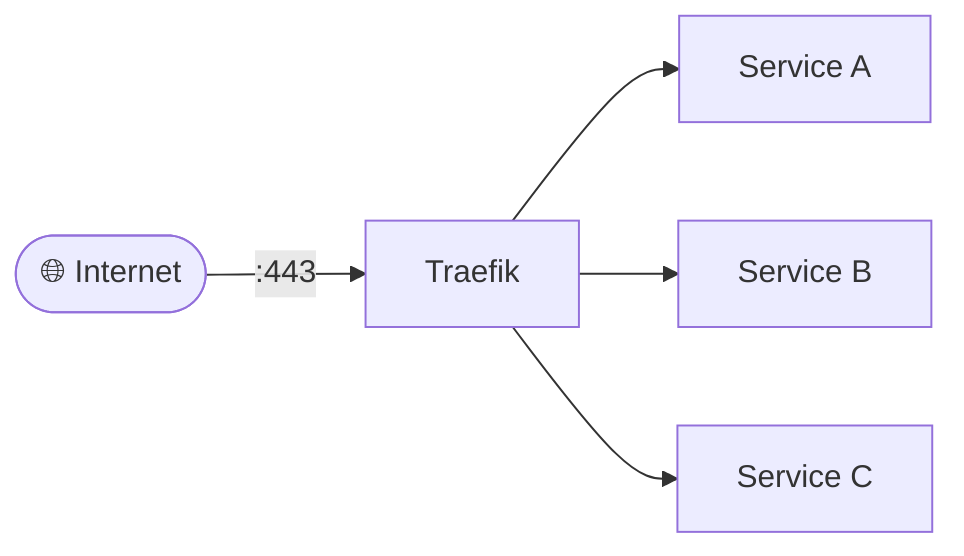
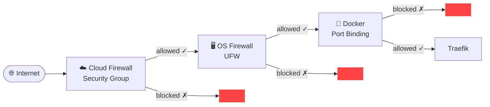
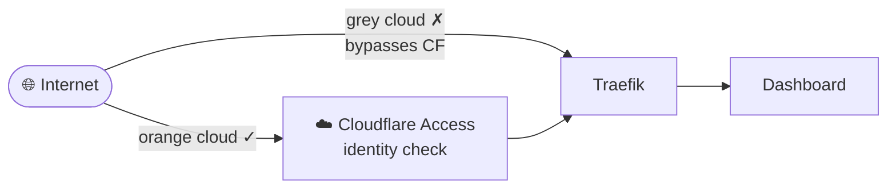
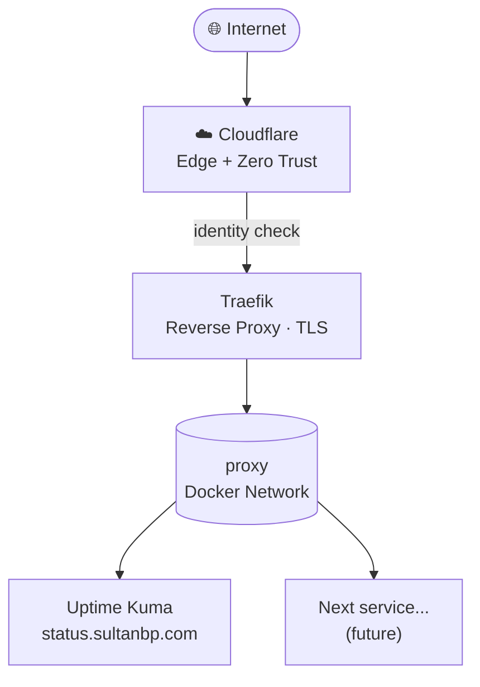

<figure>
  
</figure>

<!-- [image: VPS dashboard or terminal showing docker ps output, something that feels like a working homelab] -->

I bought this VPS to host my personal website. Then I moved the site to GitHub Pages, and the VPS just sat there doing nothing.

For a while I kept telling myself I'd do something with it. Today I actually did.

## The starting point

Before anything else, I ran through the usual setup: hardening the server, getting ZSH configured the way I like it. Nothing exciting, just the baseline I always do when touching a new Linux machine. I have docs for this now, which made it faster.

Then I had to decide what to actually build.

## Picking a reverse proxy

The first real decision was choosing a reverse proxy. I had three options in mind: Nginx, Caddy, and Traefik.

Nginx is the obvious choice if you want something battle-tested and well-documented. Caddy is simpler and handles TLS automatically. Traefik is more opinionated but fits naturally into a Docker-first workflow.

I went with Traefik. Not because it's the best in every situation, but because it matched where I want to go: more Docker, eventually Kubernetes, observability tooling. Traefik felt like the right bridge into that ecosystem rather than something I'd have to replace later.



The goal was to centralize everything through one entry point: HTTPS/TLS handling, routing, service exposure. Instead of punching holes in the firewall for every container, everything goes through Traefik.

## Docker networking and the `proxy` network

The first thing I set up was a shared Docker network called `proxy`. This is the internal communication layer. Traefik lives on it, and any service that needs to be reachable through Traefik also joins it.

One thing I learned here: `external: true` in Docker Compose means you're attaching to an already-existing network, not creating a new isolated one per project. Sounds obvious in hindsight, but it's one of those things you only really understand when you set it up yourself.

## Getting Traefik running — and the first problems

I deployed Traefik with automatic Let's Encrypt, Docker provider auto-discovery, and HTTPS routing. For debugging, I temporarily enabled the insecure dashboard on port `8080`.

Then things got interesting.

**Problem 1: Cloudflare 522 errors**

The dashboard worked fine locally. From the outside, Cloudflare was returning `522` errors. I assumed it was a Traefik routing issue or something with TLS.

It wasn't. It was firewalls, multiple of them, all acting independently.

I had:
- Tencent Cloud security group (the cloud provider firewall)
- UFW inside the VM
- Docker port exposure

All three need to allow traffic for anything to actually reach the service. Even if Docker exposes a port correctly, if the cloud firewall blocks it, nothing gets through. And if the cloud firewall allows it but UFW doesn't, same result.



This was a good reminder that "it's not working" in networking usually means "one of several layers is blocking it. Check each one."

**Problem 2: Let's Encrypt failing**

Traefik kept failing ACME certificate registration. The error looked like an ACME protocol issue, so I spent time looking in the wrong direction.

The actual cause: I had wrapped the email value in quotes inside the command argument. Something like `--certificatesresolvers.letsencrypt.acme.email="me@example.com"`. The quotes got parsed as part of the value.

After removing the quotes and resetting `acme.json`, TLS worked immediately. Classic configuration parsing issue disguised as something more complicated.

## Cloudflare Access for the dashboard

Once Traefik was stable, I moved the dashboard behind Cloudflare Access instead of leaving it exposed on port `8080`.

The flow became:

```
Internet → Cloudflare Access → Traefik → internal services
```

This was the first time I properly used Cloudflare's Zero Trust setup. One thing that tripped me up: Cloudflare Access only works when traffic actually flows through Cloudflare's network. The DNS record needs to be proxied (orange cloud), not DNS-only (grey cloud). I had it set to grey cloud initially, which meant traffic bypassed Cloudflare entirely and Access did nothing.



Once I switched to proxied mode, the identity gate worked. I removed the insecure `8080` exposure since it was no longer needed.

## Adding Uptime Kuma

With Traefik running, I wanted some basic observability. I set up Uptime Kuma as the first monitoring component.

The important part here was keeping it internal, no direct port exposure. It joins the `proxy` network and Traefik routes to it. Same pattern as everything else.

<!-- [image: Uptime Kuma dashboard showing a few monitors, green status] -->

While setting this up I picked up a few things I hadn't thought much about before:

- **Restart policies:** `always` vs `unless-stopped`. The difference matters when you manually stop a container and don't want it auto-restarting.
- **Log rotation:** `max-size` and `max-file` in Docker logging config. Without this, containers can quietly fill up disk over time.
- **`umask` and volume permissions:** why mounted Docker volumes sometimes have unexpected file permissions and how `umask` affects that.

Small things, but the kind you only learn when you're actually running something.

**One more debugging moment:** I set up a monitor in Uptime Kuma for the Traefik dashboard and it kept showing as pending or failing. I assumed Cloudflare Access was blocking the health checks.

It wasn't. I was monitoring the wrong URL. The Traefik dashboard requires the `/dashboard/` path, with the trailing slash. Once I fixed the URL, the monitor worked fine.

Good reminder: before assuming an architectural problem, check whether you're actually hitting the right endpoint.

## Where it ended up

By the end of the session, the VPS went from an idle machine to something that actually does things:

- Traefik handling all ingress with automatic HTTPS
- Cloudflare edge protection and Zero Trust auth on the dashboard
- Layered firewalling (cloud + OS + Docker)
- Uptime Kuma monitoring internal services
- Everything on a shared internal Docker network



More than the stack itself, what I got out of this session was a clearer mental model of how all these layers interact. Firewall rules, Docker networking, reverse proxy routing, Cloudflare proxying. They're all separate systems that need to agree with each other. When something breaks, it's usually because one layer doesn't know what another layer is doing.

The VPS is no longer idle. And I already have a list of what to add next.
