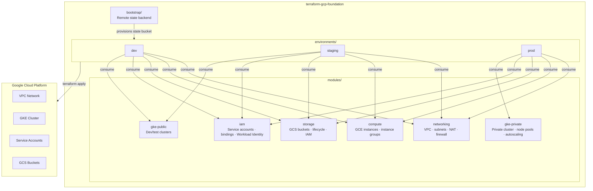

## Problem

Spinning up GCP infrastructure from scratch on every project leads to inconsistency — different teams use different VPC configurations, IAM patterns, and GKE setups. There's no single source of truth, no reusability, and no guardrails.

The goal was to build a Terraform foundation that could be dropped into any GCP project and provide a consistent, opinionated starting point for cloud infrastructure — with proper state management, environment isolation, and reusable modules that don't need to be rewritten each time.

## Solution

A modular Terraform repository structured around two concerns: **reusable modules** and **environment-specific configurations**. Modules are generic and composable. Environments consume those modules with their own variable files, each backed by isolated remote state.

The bootstrap layer handles the chicken-and-egg problem of remote state — it provisions the GCS bucket and state locking infrastructure before anything else runs.

## Stack

| Layer | Technology |
|---|---|
| Infrastructure as Code | Terraform >= 1.5.0 |
| Cloud Provider | Google Cloud Platform |
| Container Orchestration | GKE (private + public clusters) |
| Networking | VPC, subnets, Cloud NAT, firewall rules |
| Identity & Access | IAM, service accounts, Workload Identity |
| State Backend | GCS + state locking |
| Language | HCL |

## Architecture



## Modules

### Networking
Creates VPC networks with configurable subnets, firewall rules, and Cloud NAT. Subnets are defined as a map, making it easy to add secondary ranges for GKE pods and services.

### Compute
Manages GCE instances and instance groups. Instances are defined declaratively as a map — add a new entry to `terraform.tfvars` to provision a new server without touching module code.

### Storage
Creates GCS buckets with lifecycle rules and IAM bindings. Handles versioning, retention policies, and access control in a single module call.

### IAM
Manages service accounts, IAM bindings, and custom roles. Includes Workload Identity bindings for GKE — maps Kubernetes service accounts to GCP service accounts without key files.

### GKE Private (Production)
Creates private GKE clusters with nodes that have no public IP addresses. Includes autoscaling node pools, Workload Identity, and shielded nodes. Designed for production workloads.

### GKE Public (Dev/Test)
Creates public GKE clusters for development and testing. Supports master authorized networks to restrict API server access. Not recommended for production.

## Environment Strategy

Each environment (`dev`, `staging`, `prod`) has:
- Its own `terraform.tfvars` with environment-specific values
- Isolated remote state in a separate GCS prefix
- Independent apply/destroy lifecycle — changes to dev don't touch prod

```
environments/
  dev/     → e2-micro instances, public GKE, relaxed firewall
  staging/ → mirrors prod topology at smaller scale
  prod/    → private GKE, e2-standard-4 nodes, strict IAM
```

## Key Design Decisions

**Remote state from day one** — the bootstrap layer provisions the GCS backend before any environment is deployed. This avoids the common mistake of starting with local state and migrating later.

**Modules are environment-agnostic** — no environment-specific logic lives inside modules. All variation is expressed through variables. This keeps modules testable and reusable across projects.

**Workload Identity over key files** — the IAM module provisions Workload Identity bindings so GKE workloads authenticate to GCP APIs without service account JSON keys. Keys are a security liability; Workload Identity eliminates them.

**Private GKE for production** — the `gke-private` module creates clusters where nodes have no public IPs. All egress goes through Cloud NAT. This significantly reduces the attack surface compared to public node pools.

## Outcome

- Reusable module library covering the core GCP infrastructure primitives
- Multi-environment support with isolated state and independent lifecycles
- Private GKE clusters with Workload Identity for production-grade security
- Bootstrap layer that makes the foundation self-contained and reproducible
- A starting point that can be forked and adapted for real GCP projects
